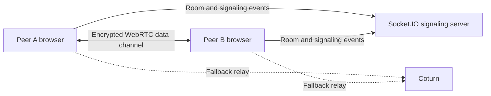

# Shipri

Privacy-first peer-to-peer file transfer for the web.

Shipri is being built around a small signaling surface and direct WebRTC data channels. File contents and metadata stay between peers; the backend coordinates room membership and connection setup without becoming a storage service.

> **Status:** active development. The protocol, security model, deployment topology, and implementation roadmap are documented; the product is not presented as production-ready yet.

## Product goals

- Direct browser-to-browser file transfer
- End-to-end encryption with keys kept out of the signaling backend
- Bounded-memory chunking and backpressure for large files
- STUN/TURN fallback for real-world network conditions
- A self-hostable deployment with Docker, Caddy, and Coturn
- A simple two-person room model with explicit file requests

## Architecture



The signaling service never receives file contents, plaintext file metadata, the shared file board, or transfer progress.

## Current stack

- React and Vite
- WebRTC / RTCDataChannel
- Socket.IO and Express
- Web Crypto API
- Caddy and Coturn
- Docker Compose

## Repository map

- `client/` - browser client and current product prototype
- `server/` - room and WebRTC signaling service
- `coturn/` - TURN configuration
- `docs/` - protocols, security model, UX flows, testing strategy, deployment design, and implementation tickets
- `docker-compose.yml` - local stack
- `docker-compose.prod.yml` - production-oriented services

Start with the [documentation index](docs/README.md) for the canonical design decisions and implementation roadmap.

## Local development

### Client

```bash
cd client
npm install
npm run dev
```

### Signaling server

```bash
cd server
npm install
npm run dev
```

Environment templates are available in `client/.env.example` and `server/.env.example`.

## Security

Shipri's security model is documented before implementation so that cryptographic and privacy boundaries are explicit. See:

- [E2EE specification](docs/security_e2ee_spec.md)
- [Open-source security audit](docs/security_audit_open_source.md)
- [P2P data protocol](docs/p2p_data_protocol_spec.md)
- [NAT traversal strategy](docs/nat_traversal_strategy.md)

## License

Apache License 2.0. See [LICENSE](LICENSE).
