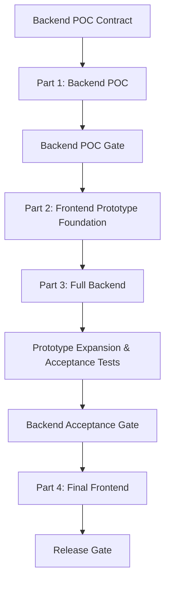

# Project Shipri Documentation Index & Roadmap

This document serves as the roadmap for the design phase of Project Shipri. It maps out all necessary architectural and technical specifications, their current status, and target goals.

---

## 1. Canonical Cross-Document Decisions

These conventions resolve conflicts between older specification drafts and must be treated as the project baseline:

1. **Room ID format**: room identifiers use the canonical format `ship-[a-f0-9]{4}`. Example: `ship-83a1`.
2. **Socket payload naming**: Socket.IO payloads use `roomId` in camelCase. Older references to `room_id` are non-canonical.
3. **Room errors**: room failures are emitted through `room:error` with a stable `code` field. Older references to a dedicated `room:full` event are non-canonical.
4. **WebRTC implementation**: the product uses native `RTCPeerConnection` and `RTCDataChannel` APIs by default. Helper libraries may be introduced only after dependency approval.
5. **E2EE metadata**: plaintext file metadata is a logical pre-encryption structure. On the wire, file metadata must be encrypted before it crosses signaling or P2P control channels.
6. **AES-GCM IV safety**: every AES-GCM encryption operation must use an IV that is unique for its key. Shipri derives separate keys for metadata and file chunks to keep IV domains separate.
7. **TURN on port 443**: Caddy owns `shipri.app:443` for HTTPS/WSS. Coturn TURNS on `443` requires a separate hostname/IP such as `turn.shipri.app`, or an explicitly documented deployment topology that prevents port conflicts.
8. **Documentation status**: `Completed` means the specification draft is complete, not that the corresponding code is fully implemented.
9. **Peer room model**: after joining, both room members are equal peers. Creator/joiner and offerer/answerer describe signaling duties only and never determine who may publish or download a file.
10. **Shared file board**: each peer may advertise local files to the other peer through the encrypted P2P control channel. Files remain on the owner's device and are transferred only after the remote peer explicitly requests a download and chooses a persistence target.
11. **Backend privacy boundary**: the signaling backend never receives the shared file board, plaintext file metadata, file requests, file contents, or transfer progress.

---

## 2. Documentation Map

| Document | Purpose | Key Sections | Specification Status |
| :--- | :--- | :--- | :--- |
| 📄 **[start_point.md](./start_point.md)** | Core vision & high-level design. | Brand concept, signaling server role, WebRTC handshake sequence. | **Completed** |
| 📄 **[p2p_data_protocol_spec.md](./p2p_data_protocol_spec.md)** | Protocol for reliable file chunking & saving. | Memory boundaries, chunking, backpressure control, hybrid disk write (Chrome vs Safari). | **Completed** |
| 📄 **[signaling_protocol_spec.md](./signaling_protocol_spec.md)** | API contract for the Socket.IO server. | Socket.IO events, payload structures, server-side room management state machine. | **Completed** |
| 📄 **[security_e2ee_spec.md](./security_e2ee_spec.md)** | Cryptographic model & Zero-Knowledge architecture. | E2EE (AES-GCM) with Web Crypto API, client-side metadata encryption, URL hash key distribution. | **Completed** |
| 📄 **[nat_traversal_strategy.md](./nat_traversal_strategy.md)** | Network connectivity and NAT traversal setup. | STUN/TURN configurations, coturn deployment parameters, network fallback statistics. | **Completed** |
| 📄 **[ui_ux_flow_spec.md](./ui_ux_flow_spec.md)** | User Interface & Client State management. | Multi-step transfer wizard UI states, QR code generator, transfer speed charts, responsive grid. | **Completed** |
| 📄 **[testing_strategy.md](./testing_strategy.md)** | QA & Testing Strategy. | Unit tests, Integration tests, Playwright E2E WebRTC tests, network condition emulation. | **Completed** |
| 📄 **[deployment_docker_spec.md](./deployment_docker_spec.md)** | Docker & Deployment architecture. | Multi-stage Dockerfiles, Caddyfile reverse-proxy config, docker-compose orchestrations. | **Completed** |
| 📄 **[security_audit_open_source.md](./security_audit_open_source.md)** | Open-Source Security & Vulnerability Analysis. | Secrets protection, CSPRNG Web Crypto, IV reuse prevention, room-creation DoS limits, TURN auth. | **Completed** |
| 📄 **[development_plan.md](./development_plan.md)** | Four-part implementation roadmap. | Backend POC, frontend prototype, full backend, final frontend, acceptance gates. | **Active** |
| 📄 **[backend_poc_plan.md](./backend_poc_plan.md)** | Minimum deployed backend starting point for frontend prototype development. | Basic rooms, signaling relay, development ICE, staging HTTPS/WSS, POC acceptance gate. | **Active** |
| 📄 **[backend_poc_tickets.md](./backend_poc_tickets.md)** | Atomic implementation backlog for the Backend POC. | Ordered ticket drafts, acceptance criteria, dependencies, staging, acceptance gate. | **Active** |
| 📄 **[frontend_prototype_plan.md](./frontend_prototype_plan.md)** | Diagnostic frontend built after Backend POC acceptance. | POC validation, room controls, WebRTC ping/pong, later ICE and forced-TURN diagnostics. | **Active** |
| 📄 **[backend_development_plan.md](./backend_development_plan.md)** | Full signaling and infrastructure implementation roadmap. | Room security, TURN credentials, abuse controls, Docker, Caddy, Coturn. | **Active** |
| 📄 **[backend_development_tickets.md](./backend_development_tickets.md)** | Atomic full backend implementation backlog. | Authorization, abuse controls, TURN credentials, deployment, Coturn, backend acceptance gate. | **Active** |
| 📄 **[frontend_development_plan.md](./frontend_development_plan.md)** | Final product frontend roadmap. | E2EE, file transfer, persistence, product UX, polish, browser E2E. | **Active** |
| 📄 **[frontend_tickets.md](./frontend_tickets.md)** | Atomic frontend implementation backlog. | Frontend prototype tickets, final frontend tickets, dependencies, acceptance gates. | **Active** |

---

## 3. Execution Order

Implementation proceeds sequentially through four parts:

### Part 1: Backend POC
* Build and deploy the minimum tested room, signaling relay, disconnect, and development ICE backend required by the frontend prototype.
* Frontend prototype implementation is blocked until this part passes its acceptance gate.

### Part 2: Frontend Prototype
* After the Backend POC gate passes, build and deploy a diagnostic room, Socket.IO, and direct WebRTC test harness. Validate it from remote devices, then expand it with authorization and forced-TURN diagnostics during full backend development.

### Part 3: Full Backend
* Build and acceptance-test secure signaling, TURN credentials, abuse protection, and production networking infrastructure.

### Part 4: Final Frontend
* Build E2EE, bounded-memory file transfer, persistence paths, complete UX, final polish, and browser E2E coverage on the frozen backend contract.
