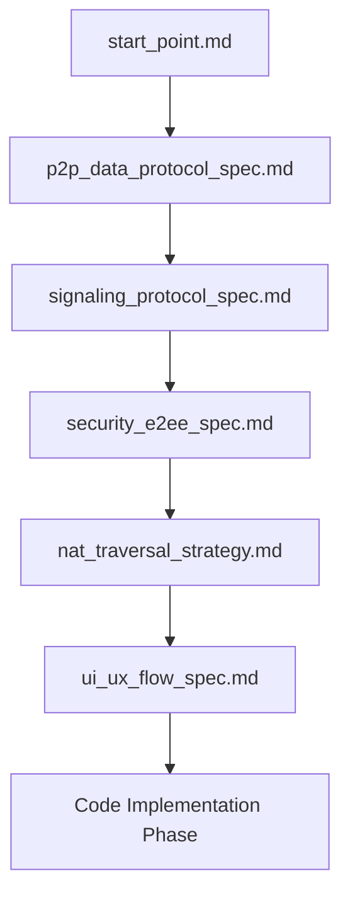

# Project Shipri Documentation Index & Roadmap

This document serves as the roadmap for the design phase of Project Shipri. It maps out all necessary architectural and technical specifications, their current status, and target goals.

---

## 1. Canonical Cross-Document Decisions

These conventions resolve conflicts between older specification drafts and must be treated as the project baseline:

1. **Room ID format**: room identifiers use the canonical format `ship-[a-f0-9]{4}`. Example: `ship-83a1`.
2. **Socket payload naming**: Socket.IO payloads use `roomId` in camelCase. Older references to `room_id` are non-canonical.
3. **Room errors**: room failures are emitted through `room:error` with a stable `code` field. Older references to a dedicated `room:full` event are non-canonical.
4. **WebRTC implementation**: the product uses native `RTCPeerConnection` and `RTCDataChannel` APIs by default. Helper libraries may be introduced only after dependency approval.
5. **E2EE metadata**: plaintext file metadata is a logical pre-encryption structure. On the wire, file metadata must be encrypted before it crosses signaling or P2P control channels.
6. **AES-GCM IV safety**: every AES-GCM encryption operation must use an IV that is unique for its key. Shipri derives separate keys for metadata and file chunks to keep IV domains separate.
7. **TURN on port 443**: Caddy owns `shipri.app:443` for HTTPS/WSS. Coturn TURNS on `443` requires a separate hostname/IP such as `turn.shipri.app`, or an explicitly documented deployment topology that prevents port conflicts.
8. **Documentation status**: `Completed` means the specification draft is complete, not that the corresponding code is fully implemented.

---

## 2. Documentation Map

| Document | Purpose | Key Sections | Specification Status |
| :--- | :--- | :--- | :--- |
| 📄 **[start_point.md](./start_point.md)** | Core vision & high-level design. | Brand concept, signaling server role, WebRTC handshake sequence. | **Completed** |
| 📄 **[p2p_data_protocol_spec.md](./p2p_data_protocol_spec.md)** | Protocol for reliable file chunking & saving. | Memory boundaries, chunking, backpressure control, hybrid disk write (Chrome vs Safari). | **Completed** |
| 📄 **[signaling_protocol_spec.md](./signaling_protocol_spec.md)** | API contract for the Socket.IO server. | Socket.IO events, payload structures, server-side room management state machine. | **Completed** |
| 📄 **[security_e2ee_spec.md](./security_e2ee_spec.md)** | Cryptographic model & Zero-Knowledge architecture. | E2EE (AES-GCM) with Web Crypto API, client-side metadata encryption, URL hash key distribution. | **Completed** |
| 📄 **[nat_traversal_strategy.md](./nat_traversal_strategy.md)** | Network connectivity and NAT traversal setup. | STUN/TURN configurations, coturn deployment parameters, network fallback statistics. | **Completed** |
| 📄 **[ui_ux_flow_spec.md](./ui_ux_flow_spec.md)** | User Interface & Client State management. | Multi-step transfer wizard UI states, QR code generator, transfer speed charts, responsive grid. | **Completed** |
| 📄 **[testing_strategy.md](./testing_strategy.md)** | QA & Testing Strategy. | Unit tests, Integration tests, Playwright E2E WebRTC tests, network condition emulation. | **Completed** |
| 📄 **[deployment_docker_spec.md](./deployment_docker_spec.md)** | Docker & Deployment architecture. | Multi-stage Dockerfiles, Caddyfile reverse-proxy config, docker-compose orchestrations. | **Completed** |
| 📄 **[security_audit_open_source.md](./security_audit_open_source.md)** | Open-Source Security & Vulnerability Analysis. | Secrets protection, CSPRNG Web Crypto, IV reuse prevention, room-creation DoS limits, TURN auth. | **Completed** |

---

## 3. Execution Order

To minimize dependency loops and ambiguity, we will build documents in the following order:

### Phase 1: Core Protocol Specs
* Define *how* data flows (P2P spec) and *how* connections are established (Signaling spec).

### Phase 2: Security & Infrastructure
* Layer E2EE cryptography on top of data streams to guarantee zero-knowledge privacy.
* Define STUN/TURN settings to ensure P2P connection success rates exceed 95%.

### Phase 3: Interface & UX
* Define visual states, progress indicators, and routing logic before launching code implementation.
