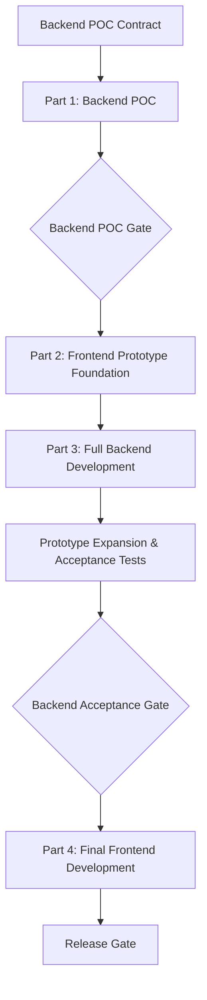

# Shipri Development Plan

Shipri development is divided into four sequential parts:

1. **[Backend POC Plan](./backend_poc_plan.md)**: build and deploy the minimum signaling backend required by the frontend prototype.
2. **[Frontend Prototype Plan](./frontend_prototype_plan.md)**: build a diagnostic client against the accepted backend POC contract.
3. **[Backend Development Plan](./backend_development_plan.md)**: complete and production-harden signaling, TURN, and deployment using the prototype as a test client.
4. **[Frontend Development Plan](./frontend_development_plan.md)**: replace the diagnostic experience with the secure, complete product frontend.

The backend POC is the mandatory starting point. Frontend prototype implementation must not begin until the POC acceptance gate passes and its minimum Socket.IO contract is frozen. This prevents frontend work from being built against mocks or unstable assumptions.

---

## 1. Current Baseline

* The frontend is a React/Vite shell that only connects to Socket.IO.
* The backend is a Node.js/Socket.IO prototype with incomplete room lifecycle and signaling security.
* Docker, Caddy, and Coturn files are initial blueprints with development placeholders.
* Automated test infrastructure and package lockfiles are absent.

---

## 2. Shared Decisions Before Implementation

These decisions must be defined at the level required by the backend POC before implementation. Production extensions may remain deferred to Part 3:

1. **Room authorization**
   * The short public room ID cannot serve as an authorization secret.
   * Record the target production authorization model, while the POC may temporarily rely only on verified room membership.

2. **Socket.IO contract**
   * Freeze event payloads, validation rules, membership requirements, stable error codes, and disconnect behavior.
   * Freeze the POC development `ice:get` response and separately define the production extension point.

3. **Backend test contract**
   * Define the POC scenarios required to start the frontend prototype: room lifecycle, stable errors, signaling relay, development ICE, and staging HTTPS/WSS connectivity.
   * Define the later full-backend scenarios that the frontend prototype must expose: authorization, direct ICE, and forced TURN.

4. **Production transfer protocol**
   * Before final frontend development, define encrypted file-board synchronization, download requests, per-transfer identities, downloader backpressure, transfer-control messages, and resume-safe encryption epochs.

5. **Testing dependencies**
   * Approve Vitest for backend and frontend unit/integration tests.
   * Approve Playwright when the production browser flow is ready.

---

## 3. Four-Part Execution Model

### Part 1: Backend POC

**Purpose:** provide the minimum tested signaling backend needed to start frontend prototype development.

The POC implements local server startup, health, basic room lifecycle, membership-safe signaling relay, disconnect cleanup, development STUN configuration, and a restricted HTTPS/WSS staging deployment. It explicitly excludes production authorization, TURN, abuse controls, and production deployment hardening.

**Gate:** automated tests pass, staging HTTPS/WSS checks pass, and the POC contract is frozen for the frontend prototype.

### Part 2: Frontend Prototype for Backend Testing

**Purpose:** provide a transparent manual test harness for backend development.

The prototype first implements room creation/joining, Socket.IO event inspection, WebRTC negotiation, data-channel ping/pong, and ICE candidate visibility against the POC. It is then deployed to staging to validate WSS and direct WebRTC between remote devices. During Part 3 it expands with authorization and forced-TURN diagnostics. It deliberately excludes production E2EE, large-file transfer, persistence, responsive design, and final UX.

**Entry gate:** Part 1 Backend POC Acceptance Gate has passed, POC tests and staging checks are green, and the minimum event contract is frozen.

**Gate:** the prototype validates the POC contract, establishes a direct WebRTC data channel, and is ready to expand alongside full backend development.

### Part 3: Full Backend Development

**Purpose:** complete signaling and deployment while using automated tests and the frontend prototype as acceptance tools.

The backend implements room authorization, lifecycle, validation, abuse controls, TURN credentials, safe configuration, Docker/Caddy/Coturn deployment, and production readiness.

**Gate:** backend integration tests pass, the prototype validates the full signaling contract, and direct plus forced-TURN connections work.

### Part 4: Final Frontend Development

**Purpose:** build the actual Shipri product on top of the accepted backend contract.

The final frontend implements an encrypted shared file board where either peer can publish local files and download remote files on demand. It also implements E2EE, bounded-memory bidirectional transfers, direct-to-disk persistence, complete UX, reconnection, browser compatibility paths, and browser E2E tests.

**Gate:** supported browsers complete secure direct-P2P and forced-TURN transfer scenarios.

---

## 4. Scope Rules

To avoid turning the prototype into an accidental production frontend:

* Prototype code may prioritize observability and explicit diagnostics over visual design.
* Prototype-only diagnostics must be isolated so they can be removed or retained as a development route.
* Frontend prototype implementation does not start against mocks before the Backend POC Acceptance Gate.
* Early staging deployment validates real HTTPS/WSS and remote network behavior, but does not imply production readiness.
* The POC contract freezes at the POC gate so frontend prototype work has a stable starting point.
* Backend contracts may expand during Parts 2 and 3, but they freeze fully at the backend acceptance gate.
* Production E2EE and file-transfer behavior starts only after the backend contract is accepted.
* Any backend contract change after the acceptance gate requires updating backend tests, the final frontend, and protocol documentation.

---

## 5. Execution Rule

Each implementation stage follows TDD:

1. Confirm or update the governing specification.
2. Add or update relevant tests.
3. Implement the smallest required behavior.
4. Run stage-specific checks.
5. Update documentation when behavior or limitations change.

The immediate next step is to resolve the backend POC contract, then begin Part 1.
