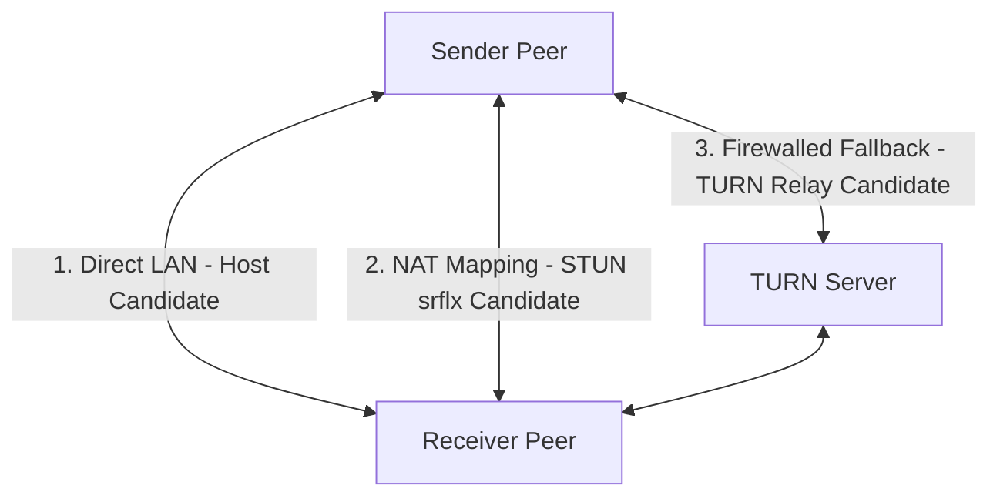

# NAT Traversal & ICE Strategy Specification (Shipri)

WebRTC establishes direct peer-to-peer connections. However, in the real world, firewalls, routers, and Network Address Translators (NAT) block direct incoming connections. This document specifies the infrastructure and configuration needed to achieve a 95%+ connection success rate using STUN and TURN servers.

---

## 1. Network Topologies & Connection Paths

When establishing a connection, the ICE (Interactive Connectivity Establishment) framework gathers three types of candidate addresses:

1. **Host Candidates**: Local network IP addresses (e.g., `192.168.1.50`). Used if both peers are in the same local area network (LAN).
2. **Server Reflexive (srflx) Candidates**: The peer's public IP and port mapped by their router (discovered via a STUN server). Used for direct P2P connections across the internet (works for Cone NATs).
3. **Relay Candidates**: The IP of a relay server (TURN server) that forwards traffic when direct P2P is impossible (typically when both peers are behind Symmetric NAT, which is standard in 4G/5G mobile carriers and corporate firewalls).



---

## 2. Infrastructure Setup: STUN vs. TURN

### 2.1. STUN Configuration (Public & Free)
STUN servers are stateless and consume virtually zero bandwidth since they only return the requester's public IP/port. We will use public Google STUN servers:
* `stun:stun.l.google.com:19302`
* `stun:stun1.l.google.com:19302`

### 2.2. TURN Configuration (Self-Hosted via Coturn)
Since Shipri transfers large files, commercial TURN services can quickly become expensive. We will self-host **Coturn** (the industry-standard open-source TURN server) on a cloud instance with a high bandwidth quota.

#### Critical Firewall Bypass (Port 443 / TLS)
Many corporate and public Wi-Fi networks block UDP traffic entirely and restrict TCP to standard web ports (80/443).
* **Strategy**: Run Coturn on port **443** using TCP and TLS (TURNS). To firewalls, this traffic looks identical to secure HTTPS traffic, allowing files to be transferred even in highly restricted corporate environments.
* **Port ownership rule**: `shipri.app:443` is reserved for Caddy HTTPS/WSS. Coturn TURNS on `443` must use a separate endpoint such as `turn.shipri.app:443` on a separate public IP, or another explicitly documented topology that avoids binding Caddy and Coturn to the same `IP:443`.

---

## 3. Dynamic Authentication (REST API Spec)

To prevent unauthorized parties from using our TURN server as a free proxy for generic traffic, we implement time-limited TURN REST API credentials compatible with Coturn `use-auth-secret`.

1. **Shared Secret**: The Signaling Server and the Coturn server share a static, long-term secret key (`TURN_SHARED_SECRET`).
2. **On-Demand Credentials**: When a client creates or joins a room, the client queries the Signaling Server for ICE configuration.
3. **Credential Calculation**: The signaling server generates ephemeral credentials valid for 2 hours:
   * **Username**: `timestamp:username_identifier` (e.g., `1785239200:user123`)
   * **Password**: `HMAC-SHA1(TURN_SHARED_SECRET, Username)`

### API Payload Schema
The client emits a request `ice:get` to the signaling server:
```json
{}
```

The server responds with the `ice:credentials` payload:
```json
{
  "iceServers": [
    {
      "urls": [
        "stun:stun.l.google.com:19302",
        "stun:stun1.l.google.com:19302"
      ]
    },
    {
      "urls": [
        "turn:turn.shipri.app:3478?transport=udp",
        "turn:turn.shipri.app:3478?transport=tcp",
        "turns:turn.shipri.app:443?transport=tcp"
      ],
      "username": "1785239200:user123",
      "credential": "computed_hmac_sha1_signature_string"
    }
  ]
}
```

---

## 4. Coturn Configuration File Setup (`turnserver.conf`)

Below is the production-ready configuration blueprint for our Coturn instance:

```ini
# Listening Ports
listening-port=3478
tls-listening-port=443

# Network bindings
listening-ip=0.0.0.0
external-ip=YOUR_SERVER_PUBLIC_IP

# Cryptography & Certificates (required for TLS/TURNS on turn.shipri.app:443)
cert=/etc/letsencrypt/live/turn.shipri.app/fullchain.pem
pkey=/etc/letsencrypt/live/turn.shipri.app/privkey.pem

# Security & Authentication
fingerprint
lt-cred-mech
use-auth-secret
static-auth-secret=YOUR_STRONG_SHARED_SECRET
realm=turn.shipri.app

# Performance Optimizations
# Disable legacy protocols to reduce attack surface
no-sslv3
no-tlsv1
no-tlsv1_1

# Logging & Performance limits
total-quota=1200
user-quota=2
syslog
```

`total-quota` and `user-quota` must be sized for the deployment budget. Avoid unlimited quotas on public deployments unless there is an external bandwidth limiter.

---

## 5. ICE Connection Optimization Rules for Clients

1. **ICE Candidate Gathering Timeout**: Sometimes ICE gathering stalls looking for interfaces that are disconnected. We set a strict client-side timeout of **5 seconds** for candidate gathering before proceeding with the handshake.
2. **WebRTC Peer Connection Options**:
   ```javascript
   const peerConnection = new RTCPeerConnection({
     iceServers: receivedIceServers,
     iceTransportPolicy: "all" // Allows fallback to TURN when relaying is needed
   });
   ```
3. **Bandwidth Warning**: If the selected ICE candidate is a `relay` candidate, notify the user in the UI: *"Direct P2P connection could not be established. Relaying via secure server (speed may be reduced)."*
