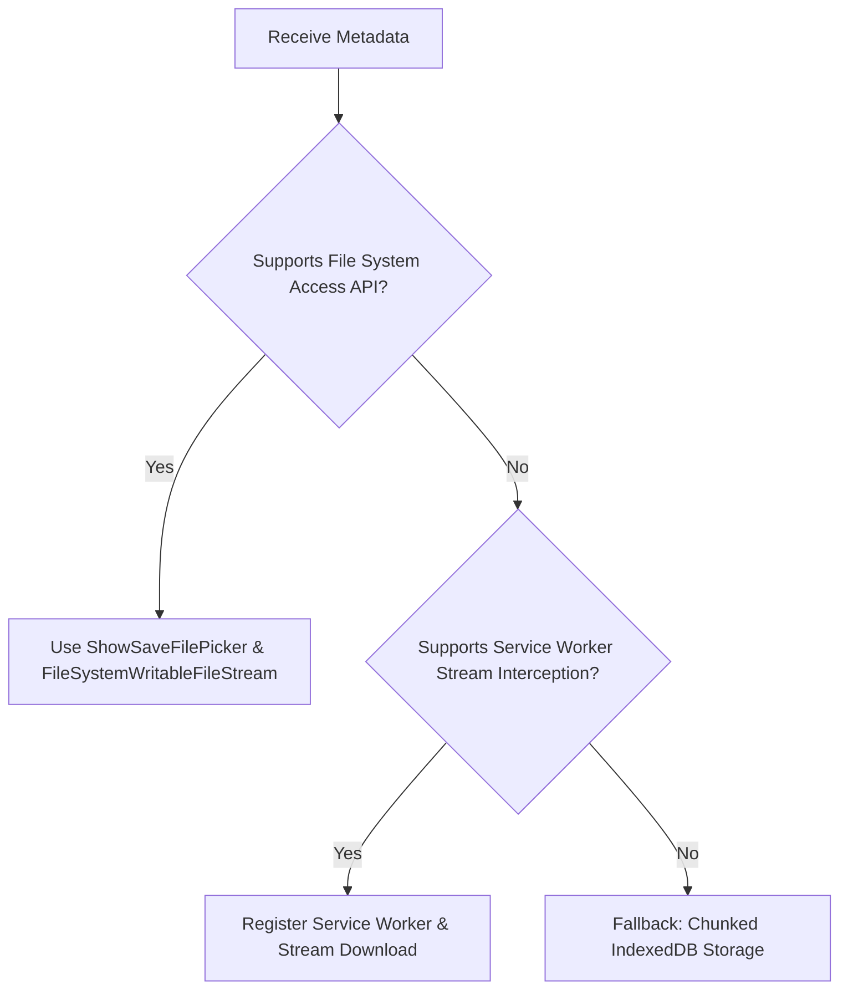

# P2P Data Protocol & Chunking Specification (Shipri)

This document outlines the technical specification for transferring files of arbitrary sizes (from 1MB to 100GB+) directly between two browsers using WebRTC Data Channels. It addresses memory management, flow control (backpressure), network limits, and disk write strategies to prevent browser tab crashes.

---

## 1. The Core Challenge: Memory Exhaustion

When handling files in the browser, developers often load the entire file into RAM (e.g., using `file.arrayBuffer()`). This works for small files (under 100MB), but will crash the browser tab or OS process when handling large files (e.g., a 10GB video file) due to the strict RAM limitations allocated to a single browser thread.

### The Shipri Solution
1. **Sender-side Streaming**: Read the file in small, sequential chunks from disk using the `Blob.slice()` API. Only one chunk (e.g., 64KB) exists in memory at any given millisecond.
2. **Backpressure (Flow Control)**: Monitor the WebRTC queue buffer. If the network interface is slower than the disk read speed, pause reading to avoid piling up data in RAM.
3. **Receiver-side Streaming**: Write incoming binary chunks directly to the disk as they arrive. Do not accumulate them in an in-memory array.

---

## 2. WebRTC Data Channel Configuration

We use two separate WebRTC data channels to decouple control signals from raw binary data. This prevents large file chunks from blocking high-priority control messages (like "Pause", "Cancel", or "Heartbeat").

### 2.1. Control Channel (`shipri-control`)
* **Purpose**: Negotiate file transfer metadata, transport commands, and sync progress stats.
* **Configuration**:
  * `ordered`: `true` (guarantees delivery order)
  * `maxRetransmits`: `null` (reliable transmission, TCP-like behavior via SCTP)
* **Payload Type**: UTF-8 String (JSON-encoded).

### 2.2. Binary Channel (`shipri-binary`)
* **Purpose**: Streaming raw chunk bytes.
* **Configuration**:
  * `ordered`: `true`
  * `maxRetransmits`: `null`
* **Payload Type**: Binary (`ArrayBuffer` or `Blob`).

---

## 3. Wire Protocol & Message Formats

### 3.1. Handshake & Meta Exchange (`shipri-control`)
Before any binary transmission starts, the Host (Sender) prepares the plaintext metadata descriptor below. This structure is the logical pre-encryption payload and must not be sent as plaintext in E2EE mode:

```json
{
  "type": "META",
  "payload": {
    "fileId": "uuid-v4-hash-string",
    "fileName": "large_video.mp4",
    "fileSize": 10737418240,
    "fileType": "video/mp4",
    "chunkSize": 65536,
    "totalChunks": 163840,
    "sha256": "optional_streaming_sha256_if_available"
  }
}
```

The wire message is `META_ENCRYPTED`, as defined in `security_e2ee_spec.md`. The Receiver decrypts it locally, presents the file proposal in the UI, and acknowledges before the sender begins streaming:
```json
{
  "type": "META_ACK",
  "payload": {
    "fileId": "uuid-v4-hash-string",
    "status": "ready"
  }
}
```

### 3.2. Control Signals during Transfer
* **Pause**: `{ "type": "PAUSE" }`
* **Resume**: `{ "type": "RESUME" }`
* **Cancel**: `{ "type": "CANCEL", "reason": "user_cancelled" }`
* **Transfer Complete**: `{ "type": "TRANSFER_COMPLETE", "payload": { "fileId": "uuid-v4-hash-string", "totalChunks": 163840 } }`
* **Transfer Error**: `{ "type": "TRANSFER_ERROR", "payload": { "code": "DECRYPTION_FAILED" } }`

---

## 4. Sender Mechanics & Flow Control (Backpressure)

A major cause of crashes in WebRTC file sharing is sending data faster than the connection can transmit it. The browser stores outgoing data in a buffer. If this buffer exceeds ~16MB (on Chrome/Firefox), the connection will drop or crash.

### 4.1. The Backpressure Loop
WebRTC provides the `RTCDataChannel.bufferedAmount` property and the `bufferedamountlow` event to manage queue sizes.

1. **Threshold Configuration**:
   * `CHUNK_SIZE` = `64 * 1024` (64 KB). This is the safest packet size to avoid packet fragmentation and browser overhead.
   * `BUFFER_THRESHOLD` = `1024 * 1024` (1 MB). The low-water mark.
   * `BUFFER_MAX` = `4 * 1024 * 1024` (4 MB). The high-water mark.

2. **Algorithm**:
   ```javascript
   let currentChunkIndex = 0;
   let isPaused = false;
   
   function sendNextChunk() {
     if (isPaused) return;

     // Check if the WebRTC buffer is getting full
     if (binaryChannel.bufferedAmount > BUFFER_MAX) {
       // Wait until the buffer drains before reading the next chunk
       binaryChannel.onbufferedamountlow = () => {
         binaryChannel.onbufferedamountlow = null; // Clear handler
         sendNextChunk();
       };
       return;
     }

     if (currentChunkIndex < totalChunks) {
       const start = currentChunkIndex * CHUNK_SIZE;
       const end = Math.min(start + CHUNK_SIZE, file.size);
       const blobSlice = file.slice(start, end);

       const reader = new FileReader();
       reader.onload = (e) => {
         const arrayBuffer = e.target.result;
         binaryChannel.send(arrayBuffer);
         currentChunkIndex++;
         
         // Tail-recursive call to process next chunk
         // Will yield to macro-task queue to prevent locking UI
         setTimeout(sendNextChunk, 0);
       };
       reader.readAsArrayBuffer(blobSlice);
     } else {
       // All chunks sent
       controlChannel.send(JSON.stringify({ type: "TRANSFER_COMPLETE" }));
     }
   }
   ```

---

## 5. Receiver Mechanics & Saving to Disk

Saving files directly to the user's hard drive without loading them fully into browser memory is the most complex part of the system due to browser sandboxing and varying API support.

We employ a **hybrid strategy** based on browser capability:



### 5.1. Primary Strategy: File System Access API (`showSaveFilePicker`)
Supported by Chrome, Edge, and Opera. It allows direct, native-speed disk writes via a file picker.

1. **Setup**:
   ```javascript
   // Triggers native system "Save As" dialog before transfer begins
   const handle = await window.showSaveFilePicker({
     suggestedName: fileName,
   });
   const writable = await handle.createWritable();
   ```
2. **Chunk Processing**:
   ```javascript
   binaryChannel.onmessage = async (event) => {
     const chunk = event.data; // ArrayBuffer
     await writable.write(chunk); // Writes chunk directly to physical disk
     // Update UI progress tracker
   };
   ```
3. **Completion**:
   ```javascript
   // Upon receiving TRANSFER_COMPLETE control message
   await writable.close();
   ```

### 5.2. Secondary Strategy: Service Worker Stream Interception
Used for browsers that lack `showSaveFilePicker` but support Service Workers, `ReadableStream`, and streaming responses reliably. This path converts the incoming WebRTC stream into an active browser download.

1. **How it works**:
   * The client registers a Service Worker.
   * The client opens a hidden `<iframe>` pointing to a special URL served by the Service Worker, e.g., `/download-stream?fileId=xyz`.
   * The Service Worker intercepts this request and returns a response containing a `ReadableStream` and headers:
     `Content-Disposition: attachment; filename="large_video.mp4"`
   * The browser treats this response as a native file download and prompts the user to select a location when supported by that browser.
   * As WebRTC chunks arrive, the main thread forwards them to the Service Worker via `postMessage`.
   * The Service Worker pushes these chunks into the active `ReadableStream` controller. The browser writes them directly to the download location using its native engine.

2. **Service Worker Implementation snippet**:
   ```javascript
   let streamController;
   
   self.addEventListener('fetch', (event) => {
     if (event.request.url.includes('/download-stream')) {
       const stream = new ReadableStream({
         start(controller) {
           streamController = controller;
         }
       });
       
       event.respondWith(new Response(stream, {
         headers: {
           'Content-Type': 'application/octet-stream',
           'Content-Disposition': 'attachment; filename="large_video.mp4"',
         }
       }));
     }
   });

   self.addEventListener('message', (event) => {
     if (event.data.type === 'CHUNK') {
       streamController.enqueue(new Uint8Array(event.data.chunk));
     } else if (event.data.type === 'CLOSE') {
       streamController.close();
     }
   });
   ```

### 5.3. Fallback Strategy: IndexedDB Chunking (For environments missing Streams)
If the browser has disabled Service Workers or does not support streaming downloads reliably, chunks are temporarily appended to an `IndexedDB` store. Once the transfer is complete, we construct a Blob from the IDB records and invoke `URL.createObjectURL(blob)`.
* *Warning*: This fallback is not compatible with the "arbitrary file size" product pillar. It is a last-resort path for smaller files and must clearly warn the user about browser quota and memory limits before acceptance.

---

## 6. Integrity & Error Recovery

### 6.1. Verification
Integrity is enforced in two layers:

1. **Required per-chunk authentication**: AES-GCM authenticates every encrypted chunk. If decryption fails, the receiver must abort the transfer and emit `TRANSFER_ERROR` with code `DECRYPTION_FAILED`.
2. **Optional whole-file checksum**: A full-file SHA-256 checksum may be shown or compared when a vetted streaming hash implementation is available. The standard Web Crypto `digest()` API is not incremental, so it must not be used in a way that requires loading large files fully into memory. Adding a streaming hash library requires dependency approval.

### 6.2. Network Interruption & Resumption
Since WebRTC connections can drop temporarily (e.g., switching from Wi-Fi to 4G):
1. **Re-connection**: The client tries to reconnect to the signaling server and re-negotiates WebRTC parameters.
2. **Chunk Position Handshake**: Once the WebRTC channels are re-opened, the Receiver sends a control message:
   ```json
   {
     "type": "RESUME_REQUEST",
     "payload": {
       "lastReceivedChunkIndex": 54201
     }
   }
   ```
3. **Resumed Stream**: The Sender updates its internal `currentChunkIndex` to `54202` and starts slicing/sending after the last fully written chunk. No data is lost, and the transfer continues seamlessly.
