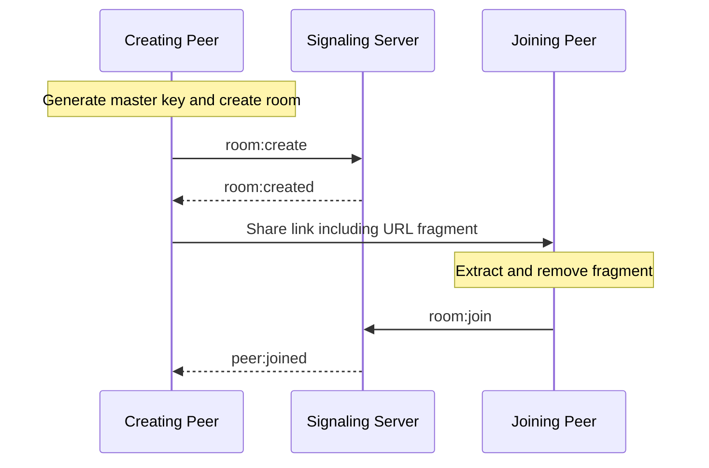

# Security & End-to-End Encryption (E2EE) Specification (Shipri)

This document describes the Zero-Knowledge security architecture for Project Shipri. It guarantees that neither the signaling server, internet service providers (ISPs), nor any third-party intermediary can inspect the filenames, file sizes, or binary contents of the files being transferred.

---

## 1. Threat Model & Security Goals

### 1.1. Assumptions & Trust Boundaries
* **Signaling Server**: Deemed **untrusted**. The system must remain secure even if the signaling server is compromised or controlled by an adversary.
* **Network Path**: Deemed **untrusted**. Standard WebRTC uses DTLS-SRTP for transport encryption, but we add an additional layer of application-level E2EE for maximum security.
* **Client Browsers (Room Peers)**: Deemed **trusted**. The code executing in both user browsers is assumed to be running in secure, non-compromised sandboxes.

### 1.2. Security Targets
1. **Confidentiality**: Only the two authorized room peers can decrypt file-board metadata, control messages, and file contents.
2. **Integrity**: Any tampering with the ciphertext by a malicious intermediary or network error must be detected instantly, aborting the transfer.
3. **Zero Metadata Leakage**: The signaling server must not see the file name, file type, or size.

---

## 2. Key Generation & Distribution (URL Fragment Method)

The fundamental pillar of Shipri's Zero-Knowledge architecture is that the decryption key is **never transmitted to any server**, including our own.



### 2.1. Master Key Generation
The creating peer generates a cryptographically secure, random 256-bit master secret using the Web Crypto API:
```javascript
const masterKeyBytes = crypto.getRandomValues(new Uint8Array(32));
const keyStringBase64 = btoa(String.fromCharCode(...masterKeyBytes))
  .replace(/\+/g, "-").replace(/\//g, "_").replace(/=/g, ""); // URL-safe Base64
```

The URL fragment carries only this random master secret. Runtime encryption keys are derived from it after import.

### 2.2. Key Derivation
Shipri derives separate AES-GCM keys for independent encryption domains:

1. `shipri-board-metadata-v1`: encrypts file advertisements.
2. `shipri-control-v1`: authenticates and encrypts download requests and transfer-control messages.
3. `shipri-file-chunks-v1`: encrypts binary file chunks with transfer ID and epoch separation.

The derivation uses Web Crypto HKDF with SHA-256, a per-room salt derived from `roomId`, and a domain-specific `info` value:

```javascript
const hkdfKey = await crypto.subtle.importKey(
  "raw",
  masterKeyBytes,
  "HKDF",
  false,
  ["deriveKey"]
);

async function deriveAesGcmKey(infoLabel, roomId) {
  const encoder = new TextEncoder();
  return crypto.subtle.deriveKey(
    {
      name: "HKDF",
      hash: "SHA-256",
      salt: encoder.encode(`shipri:${roomId}`),
      info: encoder.encode(infoLabel),
    },
    hkdfKey,
    { name: "AES-GCM", length: 256 },
    false,
    ["encrypt", "decrypt"]
  );
}
```

### 2.3. URL Hash Anchor (`#`)
The key is appended to the room URL as a fragment identifier:
`https://shipri.app/room/ship-83a1#key=url_safe_base64_key`

* **Why this is secure**: According to RFC 3986, the fragment identifier (everything after `#`) is processed strictly client-side by the browser. It is **never** sent to the server in HTTP requests or WebSocket handshake headers.
* **Required cleanup**: After extracting the key, the joining peer must remove the fragment from the visible address bar with `window.history.replaceState(null, "", window.location.pathname)`.

---

## 3. Metadata Encryption

Since the signaling server must not know which files are available, every file advertisement is encrypted before it crosses the P2P control channel.

1. **Structure of Plaintext Metadata**:
   ```json
   {
     "fileName": "project_confidential.pdf",
     "fileSize": 54200102,
     "fileType": "application/pdf",
     "sha256": "optional_streaming_sha256_if_available"
   }
   ```
2. **Encryption**:
   * The metadata is JSON-stringified and encrypted using the `shipri-board-metadata-v1` AES-GCM key.
   * We use a random 12-byte Initialization Vector (IV) generated with `crypto.getRandomValues`.
3. **P2P File Advertisement Payload**:
   ```json
   {
     "type": "FILE_ADVERTISE",
     "payload": {
       "fileId": "opaque_random_file_id",
       "iv": "base64_encoded_12_bytes_iv",
       "ciphertext": "base64_encoded_encrypted_metadata"
     }
   }
   ```
4. **Decryption**: The remote peer derives the same board-metadata key, decrypts the advertisement locally, and presents it in the shared file board.

Plaintext metadata is local logical content only. It must never cross Socket.IO or a P2P channel without application-level encryption.

---

## 4. Binary Chunk Encryption (AES-GCM Streaming)

To support arbitrary file sizes, the file is encrypted chunk-by-chunk on the fly. 

* **Algorithm**: **AES-GCM (Galois/Counter Mode)**. This is an Authenticated Encryption with Associated Data (AEAD) algorithm. It provides both encryption (confidentiality) and authentication (integrity) via an authentication tag.
* **Chunk Overhead**: AES-GCM adds a small size overhead per chunk:
  * **16 bytes** for the Authentication Tag (automatically appended by Web Crypto API).
  * The IV is deterministic from the chunk index and is not transmitted per chunk.
  * Total wire overhead per 64KB chunk = **16 bytes**. For a 1GB file (16,384 chunks), the total encryption overhead is **256 KB**, which is negligible.

### 4.1. Nonce/IV Management
To prevent cryptographic attacks, **never reuse an IV with the same key**.
* We use a 12-byte (96-bit) counter initialization vector with the `shipri-file-chunks-v1` key.
* The IV starts at `0` for the first chunk and increments by `1` for each subsequent chunk.
* Because the chunk index is deterministic, the Receiver reconstructs the matching IV based on the index of the chunk it is processing.

```javascript
// Example of creating the IV buffer from a chunk index counter
function getIvForChunk(chunkIndex) {
  const buffer = new ArrayBuffer(12);
  const view = new DataView(buffer);
  // Write the 64-bit integer index into the last 8 bytes of the 12-byte buffer
  // (leaving the first 4 bytes as 0)
  view.setBigUint64(4, BigInt(chunkIndex), false); // Big-endian
  return buffer;
}
```

### 4.2. Encryption Flow (File Owner)
```javascript
const iv = getIvForChunk(currentChunkIndex);
const encryptedChunk = await window.crypto.subtle.encrypt(
  {
    name: "AES-GCM",
    iv: iv
  },
  fileChunksKey,
  rawChunkArrayBuffer
);
// Send the encrypted encryptedChunk (which includes the 16-byte auth tag at the end)
binaryChannel.send(encryptedChunk);
```

### 4.3. Decryption Flow (Downloader)
```javascript
const iv = getIvForChunk(expectedChunkIndex);
try {
  const decryptedChunk = await window.crypto.subtle.decrypt(
    {
      name: "AES-GCM",
      iv: iv
    },
    fileChunksKey,
    incomingEncryptedChunk
  );
  
  // Write decryptedChunk to the selected persistence target
  await writableStream.write(decryptedChunk);
  expectedChunkIndex++;
} catch (error) {
  // Integrity check failed! (e.g. tag mismatch or tampered chunk)
  console.error("Decryption failed! The chunk has been tampered with or corrupted.");
  abortTransfer();
}
```

---

## 5. Summary of Web Crypto API Constraints & Workarounds

1. **Main-Thread Performance**: Encrypting and decrypting blocks of 64KB via the Web Crypto API on the main thread is fast enough for connections up to ~200-300 Mbps. For Gigabit speeds, the main thread can stall, causing UI stuttering.
   * **Mitigation**: Move owner-side encryption and downloader-side decryption loops inside a browser **Web Worker**.
2. **Secure Contexts Required**: The `crypto.subtle` API is **only** available in Secure Contexts (HTTPS or `localhost`). Shipri cannot run in E2EE mode over plain HTTP.

---

## 6. References

* [MDN Web Crypto API `AesGcmParams`](https://developer.mozilla.org/en-US/docs/Web/API/AesGcmParams): AES-GCM IVs must be unique for every encryption operation with a given key.
* [NIST SP 800-38D](https://nvlpubs.nist.gov/nistpubs/legacy/sp/nistspecialpublication800-38d.pdf): GCM IVs are nonces and 96-bit IVs are the recommended form for interoperability and performance.
