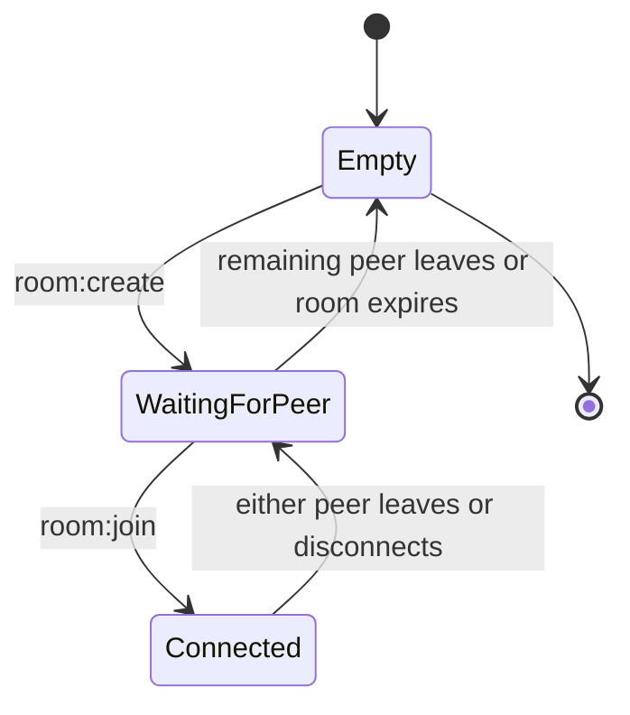

# Signaling Protocol & Room Logic Specification (Shipri)

The Socket.IO signaling server coordinates two browser peers and relays WebRTC negotiation data. It never receives file-board state, plaintext file metadata, file requests, file contents, or transfer progress.

---

## 1. Canonical Peer Model

* A room contains zero, one, or two authorized peers.
* Both connected members are equal product peers and may publish local files or request remote files.
* `creator` and `joiner` describe room-entry history only.
* The creator is the deterministic initial WebRTC offerer and the joiner is the initial answerer. These negotiation duties never define transfer direction.
* A room remains available while at least one authorized peer is connected. It is removed when empty or expired.



---

## 2. Room Rules

1. Room capacity is exactly two active connections.
2. Room IDs use `ship-[a-f0-9]{4}` and cryptographically secure generation.
3. Production room authorization is independent from the short room ID.
4. Both members may relay signaling data only to the other active member.
5. A third connection receives `ROOM_FULL`.
6. An empty room is deleted immediately. Idle and maximum lifetime rules are enforced by the production backend.

---

## 3. Socket.IO Events

### 3.1. Create Room

Client emits:

```json
{ "event": "room:create", "payload": {} }
```

Server responds:

```json
{
  "event": "room:created",
  "payload": {
    "roomId": "ship-83a1",
    "peerId": "opaque_peer_id",
    "negotiationDuty": "offerer"
  }
}
```

### 3.2. Join Room

Client emits:

```json
{
  "event": "room:join",
  "payload": {
    "roomId": "ship-83a1"
  }
}
```

Server confirms membership to the joining peer:

```json
{
  "event": "room:joined",
  "payload": {
    "roomId": "ship-83a1",
    "peerId": "opaque_peer_id",
    "negotiationDuty": "answerer"
  }
}
```

The existing member receives:

```json
{
  "event": "peer:joined",
  "payload": {
    "peerId": "opaque_peer_id"
  }
}
```

### 3.3. Leave and Disconnect

Either peer may emit:

```json
{
  "event": "room:leave",
  "payload": {
    "roomId": "ship-83a1"
  }
}
```

The remaining peer receives:

```json
{
  "event": "peer:left",
  "payload": {
    "peerId": "opaque_peer_id",
    "reason": "leave"
  }
}
```

Disconnect uses the same `peer:left` event with `reason: "disconnect"`. The remaining peer stays in the room and becomes the offerer for a future replacement connection.

### 3.4. Signal Relay

Either room member emits:

```json
{
  "event": "signal:forward",
  "payload": {
    "roomId": "ship-83a1",
    "signalData": {}
  }
}
```

The backend validates membership and relays the opaque `signalData` only to the other active peer as `signal:receive`.

### 3.5. ICE Credentials

Authorized peers emit `ice:get`. The server returns `ice:credentials` with the configured STUN/TURN servers. TURN credentials are ephemeral and never expose `TURN_SHARED_SECRET`.

### 3.6. Stable Errors

All room failures use `room:error` with a stable `code`. Required codes include:

* `ROOM_NOT_FOUND`
* `ROOM_FULL`
* `INVALID_ROOM_ID`
* `UNAUTHORIZED`
* `PEER_UNAVAILABLE`
* `SERVER_BUSY`

---

## 4. Server Memory Schema

```typescript
interface RoomPeer {
  peerId: string;
  socketId: string;
  joinedAt: number;
}

interface Room {
  roomId: string;
  peers: RoomPeer[];
  createdAt: number;
  expiresAt: number;
}
```

The backend stores no file-board or transfer state.

---

## 5. Security and Validation

* Validate every payload and room membership before relaying.
* Treat peer and socket identifiers as opaque operational data.
* Do not log SDP bodies, ICE credentials, authorization tokens, E2EE keys, file metadata, or transfer payloads.
* Apply production authorization, CORS, rate limits, room limits, and TTL as defined by the backend and security plans.
