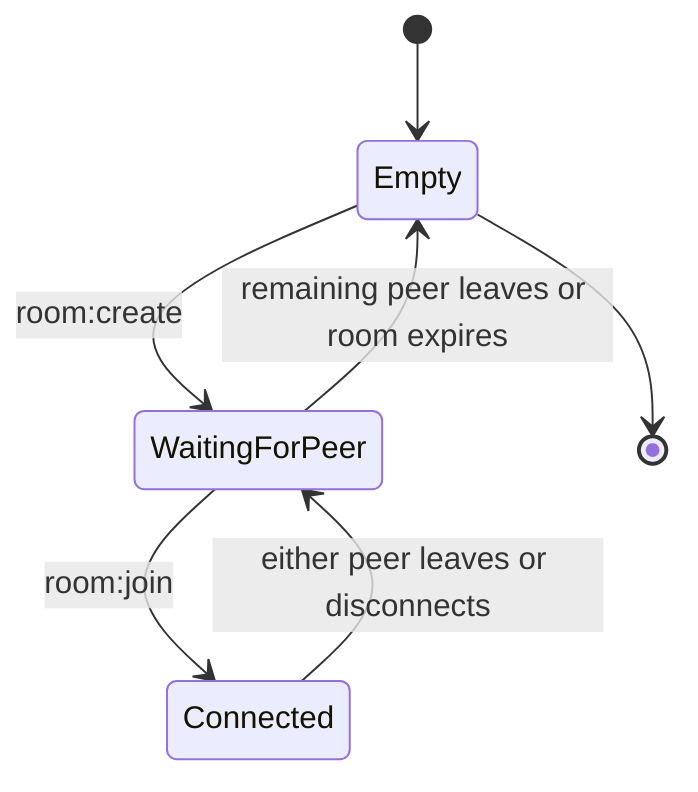

# Signaling Protocol & Room Logic Specification (Shipri)

The Socket.IO signaling server coordinates two browser peers and relays WebRTC negotiation data. It never receives file-board state, plaintext file metadata, file requests, file contents, or transfer progress.

---

## 1. Canonical Peer Model

* A room contains zero, one, or two authorized peers.
* Both connected members are equal product peers and may publish local files or request remote files.
* `creator` and `joiner` describe room-entry history only.
* The creator is the deterministic initial WebRTC offerer and the joiner is the initial answerer. These negotiation duties never define transfer direction.
* A room remains available while at least one authorized peer is connected. It is removed when empty or expired.



---

## 2. Room Rules

1. Room capacity is exactly two active connections.
2. Room IDs use `ship-[a-f0-9]{4}` and cryptographically secure generation.
3. Production room authorization is independent from the short room ID.
4. Both members may relay signaling data only to the other active member.
5. A third connection receives `ROOM_FULL`.
6. An empty room is deleted immediately. Idle and maximum lifetime rules are enforced by the production backend.

---

## 3. Socket.IO Events

This section is the canonical Socket.IO contract. Examples use an `{ "event": "...", "payload": ... }` envelope for documentation clarity; actual Socket.IO clients emit the event name with the payload object.

All payloads use `roomId` in camelCase whenever a room identifier is present. The Backend POC implements the contract below with in-memory rooms, socket-membership validation, development STUN-only ICE configuration, and no production authorization. Production authorization, room TTL, rate limits, dynamic TURN credentials, and operational hardening are deferred to full backend development.

The schema declarations below use TypeScript notation for readability only. The current implementation remains JavaScript.

Shared schema aliases:

```typescript
// Canonical short room identifier visible to both browser peers.
type RoomId = `ship-${string}`; // Must match ship-[a-f0-9]{4}.

// Backend-generated peer identifier. Clients must treat it as opaque.
type PeerId = string; // Opaque to clients.

// Deterministic WebRTC offer/answer duty for the initial negotiation only.
type NegotiationDuty = 'offerer' | 'answerer';

// Reason sent to the remaining peer when the other peer leaves the room.
type PeerLeftReason = 'leave' | 'disconnect';

// JSON-compatible value used for opaque WebRTC signaling payloads.
type JsonValue = null | boolean | number | string | JsonValue[] | { [key: string]: JsonValue };

// SDP or ICE candidate data passed through without backend inspection.
type SignalData = { [key: string]: JsonValue }; // Opaque WebRTC signaling data.

// Browser RTCPeerConnection ICE server entry.
type IceServer = {
  // STUN or TURN URL, or a browser-supported list of URLs.
  urls: string | string[];

  // Optional TURN username. Omitted for Backend POC STUN-only responses.
  username?: string;

  // Optional TURN password or OAuth credential. Omitted in the Backend POC.
  credential?: string;

  // Optional browser ICE credential type.
  credentialType?: 'password' | 'oauth';
};
```

### 3.1. Create Room

Client to server:

```json
{ "event": "room:create", "payload": {} }
```

Server to creating client:

```json
{
  "event": "room:created",
  "payload": {
    "roomId": "ship-83a1",
    "peerId": "opaque_peer_id",
    "negotiationDuty": "offerer"
  }
}
```

Schema:

```typescript
// Empty request payload. The server creates a new room for the emitting socket.
type RoomCreatePayload = Record<string, never>;

// Successful room creation response sent only to the creating peer.
interface RoomCreatedPayload {
  // Newly allocated canonical room ID.
  roomId: RoomId;

  // Opaque identifier assigned to the creating peer.
  peerId: PeerId;

  // Creator starts as the deterministic initial WebRTC offerer.
  negotiationDuty: 'offerer';
}
```

### 3.2. Join Room

Client to server:

```json
{
  "event": "room:join",
  "payload": {
    "roomId": "ship-83a1"
  }
}
```

Server to joining client:

```json
{
  "event": "room:joined",
  "payload": {
    "roomId": "ship-83a1",
    "peerId": "opaque_peer_id",
    "negotiationDuty": "answerer"
  }
}
```

Server to existing room member:

```json
{
  "event": "peer:joined",
  "payload": {
    "roomId": "ship-83a1",
    "peerId": "opaque_peer_id"
  }
}
```

Schema:

```typescript
// Request payload used by the second peer to join an existing room.
interface RoomJoinPayload {
  // Canonical room ID received out of band from the creator.
  roomId: RoomId;
}

// Successful join response sent only to the joining peer.
interface RoomJoinedPayload {
  // Joined room ID.
  roomId: RoomId;

  // Opaque identifier assigned to the joining peer.
  peerId: PeerId;

  // Joiner starts as the deterministic initial WebRTC answerer.
  negotiationDuty: 'answerer';
}

// Notification sent to the existing peer after another peer joins.
interface PeerJoinedPayload {
  // Room where the new peer joined.
  roomId: RoomId;

  // Opaque identifier for the peer that just joined.
  peerId: PeerId;
}
```

### 3.3. Leave and Disconnect

Either peer may emit `room:leave`.

Client to server:

```json
{
  "event": "room:leave",
  "payload": {
    "roomId": "ship-83a1"
  }
}
```

Server to remaining room member:

```json
{
  "event": "peer:left",
  "payload": {
    "roomId": "ship-83a1",
    "peerId": "opaque_peer_id",
    "reason": "leave"
  }
}
```

Disconnect uses the same `peer:left` event with `reason: "disconnect"`. The remaining peer stays in the room and becomes the offerer for a future replacement connection.

Schema:

```typescript
// Request payload used by either active peer to leave intentionally.
interface RoomLeavePayload {
  // Room the emitting peer wants to leave.
  roomId: RoomId;
}

// Notification sent to the peer that remains in the room.
interface PeerLeftPayload {
  // Room where the peer departure happened.
  roomId: RoomId;

  // Opaque identifier for the peer that left or disconnected.
  peerId: PeerId;

  // Whether the peer explicitly left or the socket disconnected.
  reason: PeerLeftReason;
}
```

### 3.4. Signal Relay

Either room member emits `signal:forward` after both peers have joined. The backend validates room membership and relays the opaque `signalData` only to the other active peer as `signal:receive`. The backend must not inspect, log, or mutate the contents of `signalData`.

Client to server:

```json
{
  "event": "signal:forward",
  "payload": {
    "roomId": "ship-83a1",
    "signalData": {}
  }
}
```

Server to the other active room member:

```json
{
  "event": "signal:receive",
  "payload": {
    "roomId": "ship-83a1",
    "peerId": "opaque_peer_id",
    "signalData": {}
  }
}
```

Schema:

```typescript
// Request payload used by one active peer to relay WebRTC signaling data.
interface SignalForwardPayload {
  // Room where both peers are active members.
  roomId: RoomId;

  // Opaque SDP offer/answer or ICE candidate data.
  signalData: SignalData;
}

// Relayed signaling payload delivered to the other active peer.
interface SignalReceivePayload {
  // Room where the signal originated.
  roomId: RoomId;

  // Opaque identifier for the peer that sent the original signal.
  peerId: PeerId;

  // Exact signaling data from the sender, uninspected and unmodified.
  signalData: SignalData;
}
```

### 3.5. ICE Credentials

Authorized room members emit `ice:get` after creating or joining a room.

Client to server:

```json
{
  "event": "ice:get",
  "payload": {
    "roomId": "ship-83a1"
  }
}
```

Backend POC server to requesting client:

```json
{
  "event": "ice:credentials",
  "payload": {
    "roomId": "ship-83a1",
    "iceServers": [
      {
        "urls": [
          "stun:stun.l.google.com:19302",
          "stun:stun1.l.google.com:19302"
        ]
      }
    ]
  }
}
```

Schema:

```typescript
// Request payload used by an active room member to fetch ICE config.
interface IceGetPayload {
  // Room whose active membership authorizes this ICE request.
  roomId: RoomId;
}

// ICE configuration response used to initialize RTCPeerConnection.
interface IceCredentialsPayload {
  // Room associated with the ICE configuration response.
  roomId: RoomId;

  // Browser-compatible STUN/TURN server list.
  iceServers: IceServer[];
}
```

The Backend POC response is development-only and contains STUN servers without credentials. Production may add TURN entries with ephemeral `username` and `credential` values, but must never expose `TURN_SHARED_SECRET`.

### 3.6. Stable Errors

All room failures use `room:error` with a stable `code`. Clients must branch on `code`, not on human-readable `message`.

Server to client:

```json
{
  "event": "room:error",
  "payload": {
    "roomId": "ship-83a1",
    "code": "ROOM_NOT_FOUND",
    "message": "Room not found."
  }
}
```

Schema:

```typescript
// Stable machine-readable error codes. Clients should branch on these values.
type RoomErrorCode =
  // Requested room does not exist or has already been removed.
  | 'ROOM_NOT_FOUND'

  // Requested room already has two active peers.
  | 'ROOM_FULL'

  // Provided room ID is missing or does not match the canonical format.
  | 'INVALID_ROOM_ID'

  // Payload is missing required fields or contains invalid field types.
  | 'INVALID_PAYLOAD'

  // Socket is not authorized to perform the requested room operation.
  | 'UNAUTHORIZED'

  // Operation requires another active peer, but none is available.
  | 'PEER_UNAVAILABLE'

  // Backend cannot accept the operation because of service limits or load.
  | 'SERVER_BUSY';

// Standard error payload for room, membership, validation, and service failures.
interface RoomErrorPayload {
  // Present when the failed operation was associated with a valid room ID.
  roomId?: RoomId;

  // Stable error code for client behavior.
  code: RoomErrorCode;

  // Human-readable diagnostic text. Clients must not branch on this value.
  message: string;
}
```

Required codes include:

* `ROOM_NOT_FOUND`
* `ROOM_FULL`
* `INVALID_ROOM_ID`
* `INVALID_PAYLOAD`
* `UNAUTHORIZED`
* `PEER_UNAVAILABLE`
* `SERVER_BUSY`

---

## 4. Server Memory Schema

```typescript
// In-memory backend record for one connected room member.
interface RoomPeer {
  // Opaque peer identifier exposed to the other room member.
  peerId: string;

  // Socket.IO connection identifier used only by the backend.
  socketId: string;

  // Millisecond timestamp for operational cleanup and diagnostics.
  joinedAt: number;
}

// In-memory room record used by the signaling backend.
interface Room {
  // Canonical room identifier.
  roomId: string;

  // Active connected peers. Capacity is exactly two.
  peers: RoomPeer[];

  // Millisecond timestamp when the room was created.
  createdAt: number;

  // Millisecond timestamp when the room expires in production.
  expiresAt: number;
}
```

The backend stores no file-board or transfer state.

---

## 5. Security and Validation

* Validate every payload and room membership before relaying.
* Treat peer and socket identifiers as opaque operational data.
* Do not log SDP bodies, ICE credentials, authorization tokens, E2EE keys, file metadata, or transfer payloads.
* Apply production authorization, CORS, rate limits, room limits, and TTL as defined by the backend and security plans.
