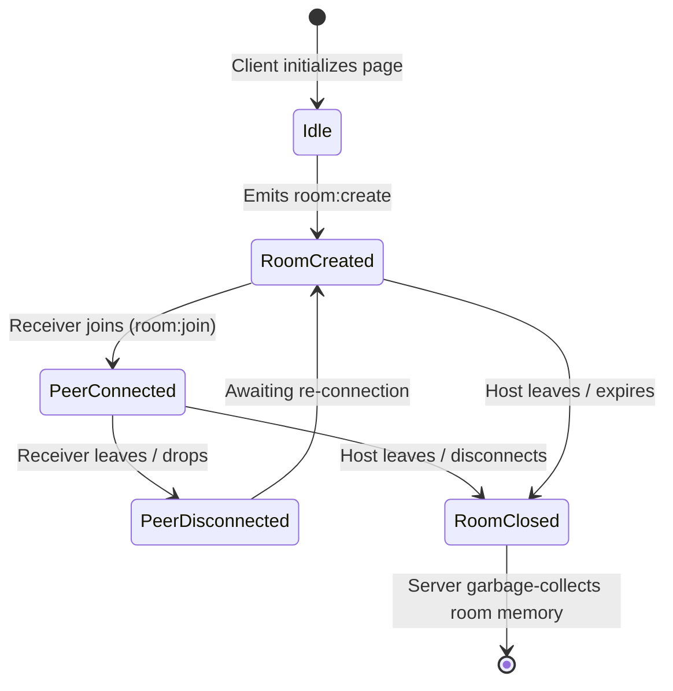

# Signaling Protocol & Room Logic Specification (Shipri)

This document specifies the communication protocol between the client applications and the Node.js signaling server using Socket.IO. The signaling server is responsible only for orchestrating rooms and relaying WebRTC metadata; it never touches file contents.

---

## 1. Lifecycle of a Room & State Machine

Each session room goes through a predefined life cycle. The signaling server must enforce these states strictly to prevent multi-peer collisions and stale memory allocation.



### 1.1. State Definitions:
* **`RoomCreated` (1 Peer)**: The Host (Sender) is in the room alone, waiting for a Receiver to join.
* **`PeerConnected` (2 Peers)**: Both Host and Receiver are active. P2P WebRTC handshake is initiated.
* **`PeerDisconnected` (1 Peer)**: The Receiver dropped. The Host is waiting for a reconnect.
* **`RoomClosed` (0 Peers)**: The session has terminated. The server clears the room identifier from memory.

---

## 2. Room Management & Allocation Rules

1. **Room Capacity Limit**: A room must never allow more than **2 connections** simultaneously. Any additional connection attempt to a full room must be rejected immediately with an error event.
2. **Room ID Format**: IDs must be short, secure, and URL-friendly. The canonical format is `ship-[a-f0-9]{4}` (for example, `ship-83a1`).
   * The server must generate the random suffix with a cryptographically secure source such as Node.js `crypto.randomBytes`, not `Math.random()`.
   * The join path must validate room IDs with `/^ship-[a-f0-9]{4}$/`.
3. **Garbage Collection (GC)**:
   * If a room is created but no second peer joins within **15 minutes**, the server automatically closes the room and disconnects the Host.
   * If both peers disconnect, the room is deleted instantly.
   * Maximum room lifetime is capped at **24 hours** to prevent memory leaks from long-lived hanging sockets.

---

## 3. Socket.IO Event Specification

All communications are JSON payloads sent via Socket.IO events.

### 3.1. Room Creation (Host Workflow)

#### A. Client Emits: `room:create`
Sent by the sender client to request a new room.
```json
{}
```

#### B. Server Responds: `room:created`
Sent to the creator client if room allocation succeeds.
```json
{
  "roomId": "ship-83a1",
  "socketId": "socket_id_of_host"
}
```

---

### 3.2. Joining a Room (Receiver Workflow)

#### A. Client Emits: `room:join`
Sent by the receiver client when loading the shared URL.
```json
{
  "roomId": "ship-83a1"
}
```

#### B. Server Responses:
* **Success**: Server joins the socket to the rooms list and emits `room:joined` to the Receiver.
  ```json
  {
    "roomId": "ship-83a1",
    "role": "receiver"
  }
  ```
  And simultaneously broadcasts `peer:joined` to the Host:
  ```json
  {
    "peerSocketId": "socket_id_of_receiver"
  }
  ```

* **Failure (Room Full)**: Server emits `room:error` to the attempting joiner if 2 peers are already connected.
  ```json
  {
    "code": "ROOM_FULL",
    "message": "This room already has 2 active peers."
  }
  ```

* **Failure (Room Not Found / Expired)**: Server emits `room:error` if the room ID doesn't exist.
  ```json
  {
    "code": "ROOM_NOT_FOUND",
    "message": "The requested room does not exist or has expired."
  }
  ```

---

### 3.3. WebRTC Signal Relay

WebRTC clients must exchange Session Description Protocol (SDP) configurations and Interactive Connectivity Establishment (ICE) candidates to discover each other. The server acts as a blind relay.

#### A. Client Emits: `signal:forward`
Sent by either client when the local WebRTC stack generates an SDP description or ICE candidate.
```json
{
  "roomId": "ship-83a1",
  "signalData": {
    "type": "offer",
    "sdp": "... cryptographic descriptors ...",
    "candidate": null
  }
}
```

For ICE candidates, `signalData` contains the candidate payload generated by the browser:

```json
{
  "roomId": "ship-83a1",
  "signalData": {
    "candidate": {
      "candidate": "...",
      "sdpMid": "0",
      "sdpMLineIndex": 0
    }
  }
}
```

#### B. Server Action: Relays `signal:receive`
The server catches `signal:forward` and immediately sends it to the *other* socket in the Room.
```json
{
  "signalData": {
    "type": "offer",
    "sdp": "..."
  }
}
```

---

### 3.4. ICE Server Credentials

Clients request STUN/TURN configuration from the signaling server before creating the `RTCPeerConnection`.

#### A. Client Emits: `ice:get`

```json
{}
```

#### B. Server Responds: `ice:credentials`

```json
{
  "iceServers": [
    {
      "urls": [
        "stun:stun.l.google.com:19302",
        "stun:stun1.l.google.com:19302"
      ]
    },
    {
      "urls": [
        "turn:turn.shipri.app:3478?transport=udp",
        "turn:turn.shipri.app:3478?transport=tcp",
        "turns:turn.shipri.app:443?transport=tcp"
      ],
      "username": "1785239200:socket-or-room-bound-id",
      "credential": "computed_hmac_sha1_signature_string"
    }
  ]
}
```

TURN credentials must be ephemeral and generated from `TURN_SHARED_SECRET` as described in `nat_traversal_strategy.md`.

---

### 3.5. Disconnections & Room Tear-Down

#### A. Receiver Disconnects (`disconnect` or `room:leave` event)
1. The server detects socket disconnect.
2. The server remains active but transitions the room state from `PeerConnected` back to `RoomCreated`.
3. The server notifies the Host through `room:error`:
   ```json
   {
     "code": "RECEIVER_DISCONNECTED",
     "message": "Receiver disconnected. Awaiting reconnection..."
   }
   ```

#### B. Host Disconnects (`disconnect`)
1. The server detects that the Host (owner of the room) has disconnected.
2. The server notifies the Receiver that the host is gone through `room:error`:
   ```json
   {
     "code": "HOST_DISCONNECTED",
     "message": "Host disconnected. Room closing."
   }
   ```
3. The server deletes the room registry and forces the Receiver's socket to leave the Socket.IO room channel.

---

## 4. Server Memory Schema (JSON Reference)

To maintain maximum performance and low memory footprint, the server stores room metadata in-memory using an object map (or Redis if scaling horizontally in the future):

```typescript
interface Room {
  roomId: string;
  hostSocketId: string;
  receiverSocketId: string | null;
  createdAt: number; // timestamp
  expiresAt: number; // timestamp
}

const activeRooms: Map<string, Room> = new Map();
```

---

## 5. Security & Rate Limiting

To prevent Denial of Service (DoS) attacks on the signaling server:
1. **IP Rate Limiting**: Limit IP addresses to a maximum of 5 `room:create` emissions per minute.
2. **Input Validation**: Strictly sanitize the `roomId` parameters on `room:join` using `/^ship-[a-f0-9]{4}$/` to prevent malformed socket channel names and injection-style payloads.
3. **No Database Writes**: Room indexing is strictly in-memory (volatile). Disk storage is never used on the signaling server.
