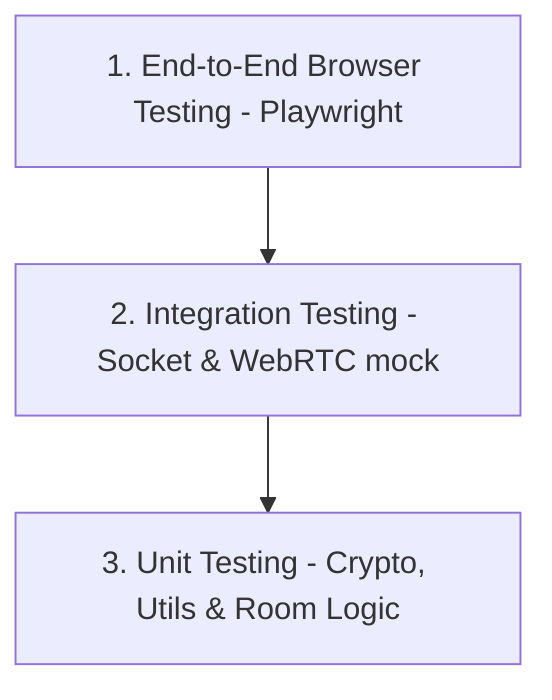
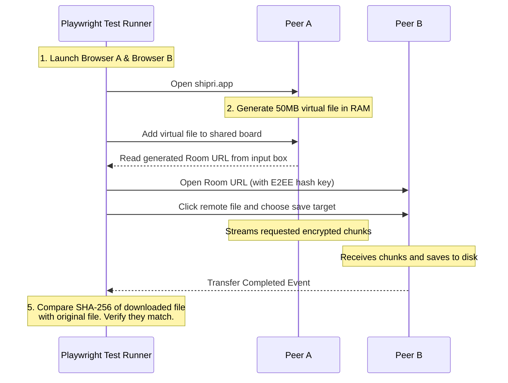

# Testing Strategy & Quality Assurance Specification (Shipri)

WebRTC applications present unique testing challenges due to their dependency on real-time network states, NAT configurations, browser sandbox security, and hardware-accelerated APIs. This document defines the testing strategy for Shipri.

---

## 1. Testing Pyramid for Shipri

Our testing strategy is split into three layers:



### 1.1. Unit Testing (Fast, Isolated)
* **Scope**: Math helpers, cryptographic encodings, encrypted board reducers, transfer identity, chunk framing, chunk index calculations, and signaling room limits logic.
* **Tools**: Vitest is the preferred candidate for this Vite/Node project, but the test infrastructure is not yet installed. Adding it requires explicit dependency approval.
* **Key Targets**:
  * Verify AES-GCM encryption and decryption outputs match standard vectors.
  * Verify the incrementing 12-byte IV generator outputs the correct binary array.
  * Verify file slice indexing (making sure offset boundaries do not miss bytes at the end of the file).

### 1.2. Current Test Infrastructure Gap
The current `client/package.json` and `server/package.json` do not define `test` scripts. Before implementation work that requires tests, the developer must propose a minimal test setup and get approval for any new dependencies.

---

## 2. Integration Testing (Signaling Protocol)

We must test that the Signaling Server correctly handles its documented room states and errors without spinning up full browsers. Timeout, rate-limit, and production authorization scenarios are added with the production backend and are not Backend POC requirements.

* **Approach**: Use real `socket.io-client` connections against an in-process test server when possible. Socket mocks may be used only for narrow unit tests.
* **Contract Source**: `signaling_protocol_spec.md` defines the canonical Socket.IO event and payload schemas. Backend POC tests must assert the documented POC contract rather than implementation-private room state.
* **Backend POC Contract Test Scenarios**:
  * **Event Payload Shapes**: Verify `room:create`, `room:created`, `room:join`, `room:joined`, `peer:joined`, `room:leave`, `peer:left`, `signal:forward`, `signal:receive`, `ice:get`, `ice:credentials`, and `room:error` use the documented payload schemas.
  * **Canonical Naming**: Verify room identifiers appear only as `roomId` in Socket.IO payloads; `room_id` is rejected or absent from all successful responses.
  * **Single Membership**: Verify one socket cannot create or join a second Shipri room while it has an active room membership.
  * **Lifecycle Transitions**: Verify no-room to one-peer creation, one-peer to two-peer join, two-peer to one-peer leave or disconnect, replacement-peer join, and one-peer to deleted-room cleanup.
  * **Room Capacity**: Create a room as Peer A, join with Peer B, and reject Peer C with `ROOM_FULL`.
  * **Peer Disconnect**: Disconnect either connected peer, emit `peer:left` with `reason: "disconnect"` to the remaining peer, keep the remaining peer in the room, and delete the room only after it becomes empty.
  * **Explicit Leave**: Emit `room:leave`, notify the remaining peer with `peer:left` and `reason: "leave"`, and remove an empty room after the final peer leaves.
  * **Negotiation Duties After Leave**: Verify the remaining peer becomes the next offerer and a replacement peer joins as answerer, regardless of which original peer left.
  * **Stable Error Matrix**: Verify each client event returns the documented first matching `INVALID_PAYLOAD`, `INVALID_ROOM_ID`, `ROOM_NOT_FOUND`, `UNAUTHORIZED`, `ROOM_FULL`, `PEER_UNAVAILABLE`, or `SERVER_BUSY` error.
  * **Error Atomicity**: Verify `room:error` is emitted only to the requesting socket and failed operations do not change room or socket membership.
  * **Repeated Leave**: Verify a repeated leave returns `UNAUTHORIZED` while another peer keeps the room active, or `ROOM_NOT_FOUND` after the final peer's first leave deletes the room.
  * **Signaling Relay**: Relay opaque `signalData` bidirectionally through `signal:forward` and `signal:receive` only between active room members without inspecting or mutating the payload.
  * **Development ICE**: Emit `ice:get` with `roomId` from an active room member and receive `ice:credentials` with documented STUN-only `iceServers`; verify the POC response contains no TURN URLs, `username`, `credential`, `credentialType`, `TURN_SHARED_SECRET`, or production secret material.
  * **Sanitization**: Emit `room:join` with malicious payloads (for example SQL injection strings or path traversals as room IDs) and verify the server rejects the input with a stable `room:error` code.
  * **POC Boundaries**: Verify POC tests do not require deferred production behavior such as access tokens, TTL cleanup, rate limits, dynamic TURN credentials, Redis, or persistent storage.

---

## 3. End-to-End (E2E) Testing (The Core QA Pillar)

To verify actual WebRTC P2P transmission, we must automate interactions between two distinct browser contexts. Playwright is the preferred candidate because it supports Chromium, Firefox, and WebKit automation, but it is not yet installed and requires dependency approval.

### 3.1. E2E Test Flow Diagram



### 3.2. Playwright Configuration Snippet
For WebRTC testing, Chromium may need specific flags to bypass UI prompts:
```javascript
import { test, expect, chromium } from '@playwright/test';

test('E2E File Transfer: Chromium to Chromium', async () => {
  // Launch Host browser with media & permission bypass flags
  const peerABrowser = await chromium.launch({
    args: [
      '--use-fake-ui-for-media-stream',
      '--use-fake-device-for-media-stream',
      '--no-sandbox'
    ]
  });
  const peerAContext = await peerABrowser.newContext();
  const peerAPage = await peerAContext.newPage();
  
  // Launch Receiver browser context
  const peerBBrowser = await chromium.launch();
  const peerBContext = await peerBBrowser.newContext();
  const peerBPage = await peerBContext.newPage();

  // Test sequence goes here...
});
```

---

## 4. Network Emulation & NAT Traversal Testing

To ensure the application performs well on poor networks and successfully falls back to TURN when direct P2P is blocked:

### 4.1. Simulating Symmetric NAT (Force TURN)
During development and CI, we must prove that the TURN server is functional and that the client gracefully falls back to it.
* **Test Method**: In Playwright or local tests, we block direct STUN connections.
* **Implementation**: We initialize the `RTCPeerConnection` with the option `iceTransportPolicy: "relay"`. This forces the browser to discard local and host candidates and route 100% of the traffic through the TURN server.
* **Verification**: Verify that the transfer completes successfully and that the client UI displays the "Relayed via Server" status message.

### 4.2. Network Interruption & Resumption (Robustness Test)
* **Test Method**:
  1. Start a 100MB file transfer.
  2. At 50%, programmatically disable the network adapter of the Sender browser (e.g., using Playwright's `context.setOffline(true)`).
  3. Wait 5 seconds (verify transfer pauses and "Reconnecting..." UI overlay appears).
  4. Enable the network adapter (`context.setOffline(false)`).
  5. **Verification**: Verify that the connection recovers and the file transfer finishes, resulting in a correct cryptographic hash match.
