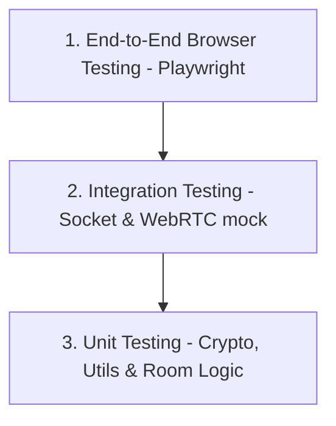
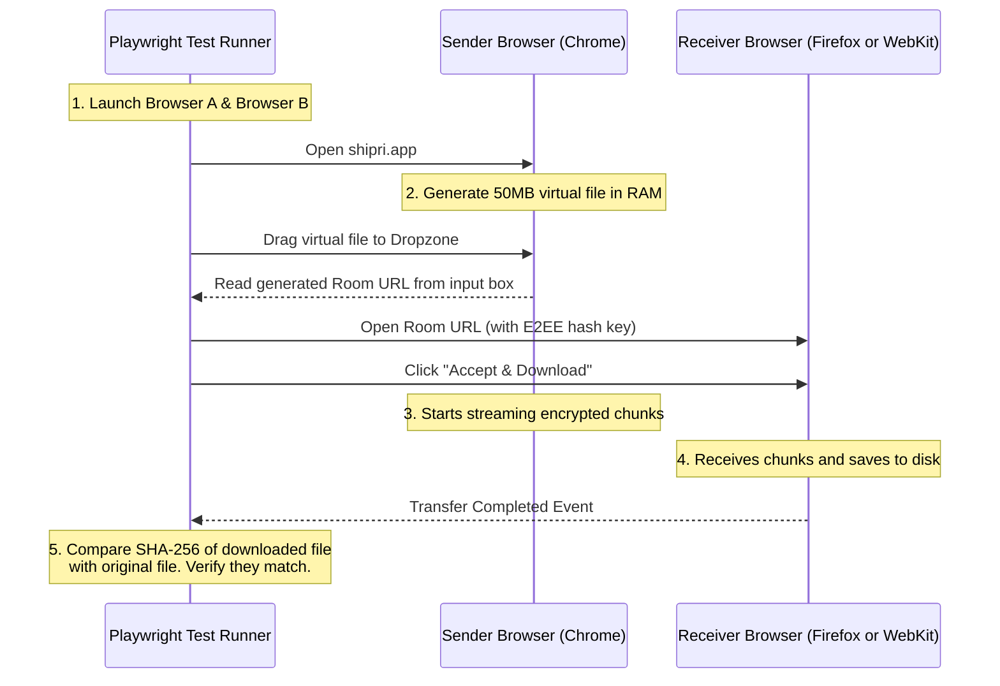

# Testing Strategy & Quality Assurance Specification (Shipri)

WebRTC applications present unique testing challenges due to their dependency on real-time network states, NAT configurations, browser sandbox security, and hardware-accelerated APIs. This document defines the testing strategy for Shipri.

---

## 1. Testing Pyramid for Shipri

Our testing strategy is split into three layers:



### 1.1. Unit Testing (Fast, Isolated)
* **Scope**: Math helpers, cryptographic encodings, chunk index calculations, signaling room limits logic.
* **Tools**: Vitest is the preferred candidate for this Vite/Node project, but the test infrastructure is not yet installed. Adding it requires explicit dependency approval.
* **Key Targets**:
  * Verify AES-GCM encryption and decryption outputs match standard vectors.
  * Verify the incrementing 12-byte IV generator outputs the correct binary array.
  * Verify file slice indexing (making sure offset boundaries do not miss bytes at the end of the file).

### 1.2. Current Test Infrastructure Gap
The current `client/package.json` and `server/package.json` do not define `test` scripts. Before implementation work that requires tests, the developer must propose a minimal test setup and get approval for any new dependencies.

---

## 2. Integration Testing (Signaling Protocol)

We must test that the Signaling Server correctly handles states, timeouts, and rate limits without spinning up full browsers.

* **Approach**: Use real `socket.io-client` connections against an in-process test server when possible. Socket mocks may be used only for narrow unit tests.
* **Test Scenarios**:
  * **Room Capacity**: Create a room as Host, join with Receiver A (succeeds), join with Receiver B (must fail with `room:error` code `ROOM_FULL`).
  * **Host Disconnect Cleanup**: Connect Host, disconnect Host ➔ verify room is deleted from memory within 1 second.
  * **Sanitization**: Emit `room:join` with malicious payloads (e.g. SQL injection strings or path traversals as Room ID) ➔ verify server rejects the input.

---

## 3. End-to-End (E2E) Testing (The Core QA Pillar)

To verify actual WebRTC P2P transmission, we must automate interactions between two distinct browser contexts. Playwright is the preferred candidate because it supports Chromium, Firefox, and WebKit automation, but it is not yet installed and requires dependency approval.

### 3.1. E2E Test Flow Diagram



### 3.2. Playwright Configuration Snippet
For WebRTC testing, Chromium may need specific flags to bypass UI prompts:
```javascript
import { test, expect, chromium } from '@playwright/test';

test('E2E File Transfer: Chromium to Chromium', async () => {
  // Launch Host browser with media & permission bypass flags
  const hostBrowser = await chromium.launch({
    args: [
      '--use-fake-ui-for-media-stream',
      '--use-fake-device-for-media-stream',
      '--no-sandbox'
    ]
  });
  const hostContext = await hostBrowser.newContext();
  const hostPage = await hostContext.newPage();
  
  // Launch Receiver browser context
  const receiverBrowser = await chromium.launch();
  const receiverContext = await receiverBrowser.newContext();
  const receiverPage = await receiverContext.newPage();

  // Test sequence goes here...
});
```

---

## 4. Network Emulation & NAT Traversal Testing

To ensure the application performs well on poor networks and successfully falls back to TURN when direct P2P is blocked:

### 4.1. Simulating Symmetric NAT (Force TURN)
During development and CI, we must prove that the TURN server is functional and that the client gracefully falls back to it.
* **Test Method**: In Playwright or local tests, we block direct STUN connections.
* **Implementation**: We initialize the `RTCPeerConnection` with the option `iceTransportPolicy: "relay"`. This forces the browser to discard local and host candidates and route 100% of the traffic through the TURN server.
* **Verification**: Verify that the transfer completes successfully and that the client UI displays the "Relayed via Server" status message.

### 4.2. Network Interruption & Resumption (Robustness Test)
* **Test Method**:
  1. Start a 100MB file transfer.
  2. At 50%, programmatically disable the network adapter of the Sender browser (e.g., using Playwright's `context.setOffline(true)`).
  3. Wait 5 seconds (verify transfer pauses and "Reconnecting..." UI overlay appears).
  4. Enable the network adapter (`context.setOffline(false)`).
  5. **Verification**: Verify that the connection recovers and the file transfer finishes, resulting in a correct cryptographic hash match.
