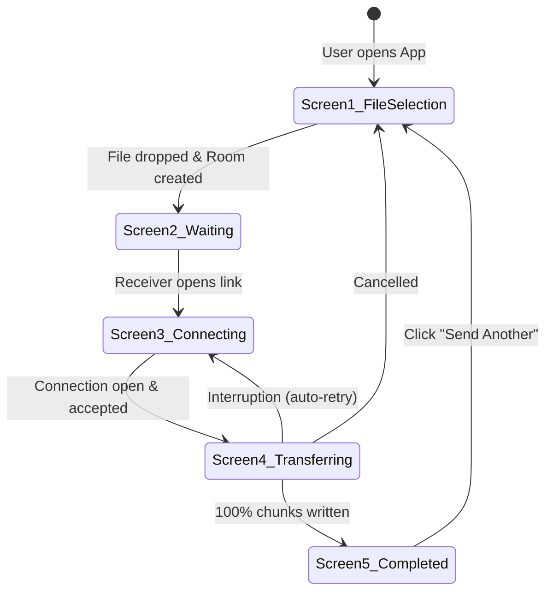

# UI/UX Screens & Client States Specification (Shipri)

This document specifies the visual components, user flows, and client-side application states for the Shipri frontend interface. The interface is designed to be premium, responsive, and provide clean real-time feedback during file transfers.

---

## 1. Visual Theme & Aesthetics

To wow users and establish a premium product feel, the UI follows these design guidelines:
* **Color Palette (Dark-Mode First)**:
  * Background: Deep space gray/black (`#0D0F12`).
  * Primary Accent: Neon Violet / Magenta gradient (`linear-gradient(135deg, #8A2BE2, #FF007F)`).
  * Success Accent: Emerald Green (`#00F5D4`).
  * Surface card colors: Semi-transparent gray with blur (`rgba(22, 26, 33, 0.7)` with `backdrop-filter: blur(12px)` - Glassmorphism).
* **Typography**: Clean, modern sans-serif using system fonts or self-hosted assets. Do not add external font providers without approval.
* **Micro-animations**: Smooth hover transitions (0.2s ease-in-out), active states, and pulsing connection dots. Keep animations lightweight and CSS-based unless an animation dependency is explicitly approved.
* **Implementation Constraints**: Use vanilla React/Vite and project-local CSS. Do not add UI frameworks, styling frameworks, QR libraries, or animation libraries without dependency approval.

---

## 2. Global State Machine (Client-Side)

The application flow on the client is managed by a single state variable.

---

## 3. Detailed Screen Breakdown

### Screen 1: File Selection (Host / Sender)
* **Goal**: Allow users to drag and drop or select a file to generate a sharing link.
* **Rule**: This is an app-first functional screen, not a marketing landing page.
* **Layout**:
  * Centered Glassmorphic Card.
  * **Dropzone Area**: Large dashed border (glows magenta when file is dragged over).
    * SVG Icon: Modern upload/rocket symbol.
    * Text: *"Drag & drop files here or click to browse"*.
    * Sub-label: *"Zero-knowledge P2P transfer. No size limit."*
* **Interactions**:
  * Dragging file over ➔ Dash border animates (pulse effect).
  * File selection ➔ Client immediately generates the 256-bit AES key, initializes Room on backend, and transitions to Screen 2.

---

### Screen 2: Waiting for Connection (Host / Sender)
* **Goal**: Provide the Host with the sharing URL and QR code.
* **Layout**:
  * **File Info Widget**: Displays file name, extension icon, and human-readable size (e.g., `4.2 GB`).
  * **Sharing URL Bar**: A read-only text input containing `https://shipri.app/room/ship-83a1#key=abc123xyz...`
    * Icon: "Copy Link" button (changes to checkmark and flashes "Copied!" for 2 seconds on click).
  * **QR Code Module**: A high-contrast QR code generated client-side from the full room URL. The implementation must use an approved dependency or a small local implementation agreed during planning.
  * **Pulse Status Indicator**: A small purple pulsing dot with text: *"Awaiting receiver... Keep this tab open."*

---

### Screen 3: File Acceptance (Receiver)
* **Goal**: Let the recipient review the file details and accept or reject the transfer.
* **Layout**:
  * **File Proposal Card**:
    * Text: *"Someone wants to share a file with you"*
    * Box showing File Details (File name, size, MIME-type).
  * **Buttons Row**:
    * **"Decline"**: Red outline button. Redirects to landing page.
    * **"Accept & Download"**: Solid neon gradient button. 
* **Interactions**:
  * Clicking "Accept" triggers `showSaveFilePicker()` (on Chrome) or starts the Service Worker stream registration (on Safari/Firefox) and emits the `META_ACK` signal to the Host.

---

### Screen 4: Active Transfer (Both Peers)
* **Goal**: Show real-time transfer progress, speed, and remaining time.
* **Layout**:
  * **Progress Ring/Bar**: Large progress bar with neon gradient fill. Inside, displays the percentage (e.g., `45.2%`).
  * **Stats Grid**:
    * **Speed**: Megabytes per second (e.g., `24.5 MB/s`).
    * **Sent/Received**: `1.8 GB / 4.2 GB`.
    * **Time Remaining (ETA)**: e.g., `1m 45s`.
  * **Controls Bar**:
    * **Pause/Resume Button**: (Sends control signal to toggle transfer loop).
    * **Cancel Button**: Closes the connection and returns to landing.
* **Interactions**:
  * **ETA Calculation**: Calculated using a moving average window (last 5 seconds of transfer speed) to prevent volatile UI jumps.

---

### Screen 5: Transfer Completed (Both Peers)
* **Goal**: Confirm successful transfer and allow sharing another file.
* **Layout**:
  * Lightweight completion animation using CSS only, unless an animation dependency is explicitly approved.
  * Checkmark icon glowing emerald green.
  * Text: *"File transferred successfully!"*
  * **Host Card**: Show button *"Send Another File"*.
  * **Receiver Card**: Show button *"Close Room"* or open file folder (if supported).

---

## 4. Connectivity Error & Reconnection UI Overlay

If the WebRTC connection drops during Screen 4 (Active Transfer):
1. The UI overlays a semi-transparent warning backdrop.
2. An amber warning icon appears with the text: *"Connection interrupted. Attempting to reconnect (Attempt 1/5)..."*
3. A progress loader loops.
4. **Resumption**: Once the connection recovers, the overlay fades out, and the progress continues from the last successfully written chunk index (without resetting to 0%).
5. **Fail State**: If reconnection fails after 5 attempts, transition back to the file selection screen and display a toast alert: *"Transfer failed due to connection timeout."*
